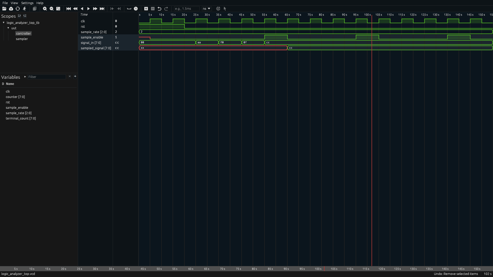

# FPGA Logic & Protocol Analyzer

An 8-channel FPGA logic analyzer built on the **Digilent Basys 3 (Xilinx Artix-7)** for capturing, triggering on, and analyzing digital signals.

> **Status:** 🚧 In Development

## Overview

I'm building this project to gain hands-on experience with FPGA development, digital design, verification, and hardware debugging.

The analyzer will sample digital signals from microcontrollers, sensors, and other digital hardware, store captured samples in FPGA Block RAM, and transfer the data to a PC for waveform visualization and protocol decoding.

The initial target is **8 channels at up to 100 MS/s**, with support for UART, SPI, and I2C analysis.

## System Architecture

```text id="2e4x1h"
ESP32 / MCU / Sensor
        │
   8 Digital Channels
        │
        ▼
┌──────────────────┐
│     Basys 3      │
│                  │
│  Input Sampling  │
│        ↓         │
│ Trigger Engine   │
│        ↓         │
│  Capture FSM     │
│        ↓         │
│  BRAM Buffer     │
└────────┬─────────┘
         │
      USB/UART
         │
         ▼
┌──────────────────┐
│        PC        │
│                  │
│ Waveform Viewer  │
│ Protocol Decoder │
└──────────────────┘
```

## Target Features

* 8 simultaneous digital input channels
* Up to 100 MS/s target sampling rate
* Configurable sampling rates
* BRAM-based capture buffer
* Rising/falling-edge triggering
* Pre/post-trigger capture
* FPGA-to-PC data transfer
* Digital waveform visualization
* UART decoding
* SPI decoding
* I2C decoding
* Frequency and pulse-width measurements

Final specifications will be based on hardware testing and timing results.

## Hardware

**Development Board:** Digilent Basys 3  
**FPGA:** Xilinx Artix-7 XC7A35T  
**System Clock:** 100 MHz  
**Test Device:** ESP32

The ESP32 will be used to generate known digital signals and UART/SPI/I2C traffic for hardware testing.

* [x] Define project architecture
* [x] Select FPGA development board
* [x] 8-channel input sampler
* [x] Configurable sampling
* [ ] BRAM capture buffer
* [ ] Trigger engine
* [ ] Capture-control FSM
* [ ] Basys 3 hardware testing
* [ ] FPGA-to-PC communication
* [ ] Waveform viewer
* [ ] UART decoder
* [ ] SPI decoder
* [ ] I2C decoder
* [ ] Performance testing

## Tools

**FPGA:** Verilog/SystemVerilog, AMD Vivado, Artix-7
**Verification:** Icarus Verilog, Surfer/GTKWave, testbenches
**Software:** Python, Git/GitHub
**Protocols:** UART, SPI, I2C

## Repository Structure

```text id="0z6o6c"
├── rtl/        # FPGA RTL
├── tb/         # Testbenches
├── sim/        # Simulation files
├── software/   # PC software
├── hardware/   # Basys 3 constraints
└── docs/       # Design documentation
```


## Current Progress

### Configurable 8-Channel Input Sampling

The input sampler captures all 8 digital channels simultaneously at a configurable sampling rate.

Supported sampling rates include 100, 50, 25, 10, 5, and 1 MS/s. A sampling controller generates a `sample_enable` signal that determines when the input channels are captured.



The simulation below uses a 25 MS/s sampling rate with a 100 MHz system clock. The sampler captures the 8-bit input only when `sample_enable` is asserted, demonstrating that input changes between sampling events are not captured.
